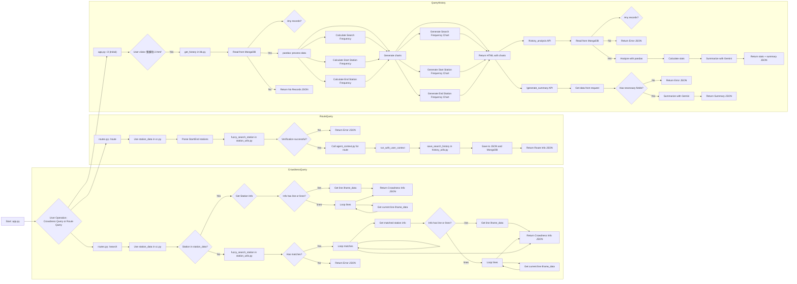

# mrt0-0
mrtlittleproject

if you do not like my introduction you could just click the link 

https://www.deepwiki.com/pupupeter/mrt0-0


https://youtu.be/izW3w9udIVs

-----------------------------------------------------------------------------------------
[中文](https://github.com/pupupeter/mrt0-0/blob/main/readmec.md)



# Taipei Metro Information Integration System

## Project Description

This project aims to build a comprehensive platform that facilitates user access to Taipei Metro information. It provides not only basic station information and route planning but also analyzes user query history and leverages large language models (LLMs) to generate valuable summaries.

**Key Features:**

* **Real-time Station Information Query:** Users can query specific metro stations, and the system displays the lines the station belongs to and integrates external resources (iframes) to show real-time congestion information. For transfer stations, the system lists information for all relevant lines.
* **Intelligent Route Planning:** The system can calculate and recommend the best travel routes based on the origin and destination stations provided by users. It offers two types of recommendations:
    * **Fastest Route:** Prioritizes travel time.
    * **Fewest Transfers Route:** Minimizes the number of transfers, enhancing travel comfort.
* **User Query History Records:** The system records user query behavior, including origin station, destination station, query time, and recommended routes. This data is used for subsequent analysis.
* **Historical Record Analysis and Summary:** By analyzing historical records, the system can generate various statistical insights, such as:
    * Popular origin and destination stations.
    * Common travel routes.
    * User query time distribution.
    * Using the Google Gemini model, the system generates summaries based on these statistics, providing in-depth insights and recommendations regarding user behavior.

## Technical Architecture

This project adopts a layered architecture, mainly comprising the following components:

* **Backend:**
    * **Flask:** A lightweight Python web framework used to handle HTTP requests, manage routes, and provide API endpoints.
    * **MongoDB:** A NoSQL database used to store metro station data and user query history records. Its flexible schema design is well-suited for storing semi-structured historical data.
    * **smolagents:** A library for building intelligent agents. In this project, it's used to calculate metro route suggestions.
    * **Google Gemini API:** Google's large language model API, used to generate summary analysis of historical records.
    * **Pandas:** A powerful Python data analysis library used to process and analyze historical query records.
    * **Plotly:** An interactive plotting library used to visualize historical record analysis results, such as generating bar charts and pie charts.
* **Data Sources:**
    * **Static Station Data:** Stored in Python dictionaries, containing information for each metro station, including its name, lines, and external iframe IDs for displaying real-time information.
    * **External Real-time Information:** Real-time metro information, such as congestion levels, is displayed by embedding iframes from external websites.

## File Description

The following provides a detailed description of the functions and designs of the main files in the project:

* **`agent_context.py`:**
    * Defines the `CodeAgent` that interacts with `smolagents` for route planning.
    * Encapsulates the Gemini model using `LiteLLMModel`.
    * Implements user query context management. The system maintains the recent query history for each user, which helps improve the accuracy of route suggestions.
    * The `run_with_user_context` function executes the Agent and updates the user context.
    * The `reset_user_context` function clears the query history for a specific user.
* **`app.py`:**
    * The entry point of the Flask application.
    * Initializes the Flask application instance.
    * Registers the main functionality routes using the `register_routes` function.
    * Registers the `history_analysis` blueprint to integrate historical record analysis-related APIs into the application.
    * Defines the `/` route to display the main page (`3.html`).
    * Defines the `/2` route to display historical record statistics charts.
    * Starts the Flask development server.
* **`bb.py`:**
    * Handles the visualization of historical records.
    * The `get_history` function retrieves query history from MongoDB.
    * Uses Pandas to transform the historical data into a DataFrame for easier analysis.
    * Uses Plotly to generate various statistical charts:
        * **Bar Chart:** Displays the number of queries per day.
        * **Pie Charts:** Display popular origin and destination stations.
    * Uses the `to_html` function to convert Plotly charts into HTML snippets and embeds them into the web page template (`2.html`).
* **`cc.py`:**
    * Contains the static data for metro stations.
    * The `station_data` dictionary stores information for each station, including:
        * `line`: The line(s) the station belongs to.
        * `iframe_id`: The ID of the external iframe used to display real-time information for that line.
        * `lines` and `iframe_ids`: For transfer stations, stores multiple lines and corresponding iframe IDs.
* **`history_analysis.py`:**
    * Implements the core functionality for historical record analysis.
    * Defines the `history_api` Blueprint to organize related API routes.
    * The `analyze_history` function:
        * Reads historical records from MongoDB.
        * Uses Pandas for data cleaning and analysis.
        * Calculates various statistical metrics, such as total queries, popular stations, common routes, and query time distribution.
        * Calls the `generate_summary_with_gemini` function to generate a summary.
        * Returns the analysis results and summary in JSON format.
    * The `generate_summary` function:
        * Allows users to provide custom statistical data and generates a corresponding summary.
    * The `generate_summary_with_gemini` function:
        * Uses the Gemini model to generate a summary of historical records.
        * Constructs a prompt containing statistical data and passes it to the Gemini model.
        * Handles the Gemini API response and potential errors.
* **`history_utils.py`:**
    * Provides utility functions for saving user query history records.
    * The `save_search_history` function:
        * Saves query records to a JSON file (`search_history.json`).
        * Inserts query records into the `mrtdata` collection in MongoDB.
* **`iframe_config.py`:**
    * Defines the settings for external iframes used to display real-time metro information.
    * The `iframe_data` dictionary stores the ID and title for each iframe.
* **`routes.py`:**
    * Defines the main routes of the application.
    * The `register_routes` function:
        * Defines the `/` route to display the main page.
        * Defines the `/search` route to query station information.
            * Receives the `query` parameter and searches for matching stations in `station_data`.
            * If a station is found, returns the relevant iframe information.
            * If no exact match is found, performs a fuzzy search using the `fuzzy_search_station` function.
        * Defines the `/route` route to get route suggestions.
            * Receives the `start` and `end` parameters and uses the `fuzzy_search_station` function to resolve station names.
            * Calls the `run_with_user_context` function to calculate route suggestions using `fastest_agent` and `fewest_transfers_agent`.
            * Uses the `parse_route_response` function to parse the Agent's response.
            * Uses the `save_search_history` function to save the query record.
        * Defines the `/reset_context` route to reset user context.
            * Receives the `user_id` parameter and clears the user's query history.
* **`station_utils.py`:**
    * Provides utility functions related to metro stations.
    * The `fuzzy_search_station` function:
        * Uses the `difflib.get_close_matches` function to perform fuzzy searches and find the closest matching station names to the user's input.
    * The `parse_route_response` function:
        * Parses the route suggestion text returned by the Agent and converts it into a structured list.

## Usage

1.  **Environment Setup:**
    * **Install Python:** Ensure you have Python 3.x installed on your system.
    * **Install MongoDB:** Download and install MongoDB Community Server. Start the MongoDB service.
    * **Set Environment Variables:**
        * Install `python-dotenv`: `pip install python-dotenv`
        * Create a `.env` file and set the MongoDB connection string and Google Gemini API key:

        ```
        MONGODB_URI="mongodb://localhost:27017/"  # Modify according to your MongoDB settings
        GEMINI_API_KEY="YOUR_GEMINI_API_KEY"
        ```

2.  **Install Dependencies:**

    ```bash
    
    pip install Flask pymongo pandas plotly-express python-dotenv smolagents google-generativeai difflib
    ```

3.  **Start the Application:**

    ```bash
    python app.py
    ```

    The application will start a development server locally.

4.  **Use the API:**

    You can interact with the application using HTTP requests. Here are some examples:

    * **Query Station Information:**

        ```
        GET /search?query=<station_name>
        ```

        * Example: `/search?query=Taipei Main Station`
        * Response: JSON format station information, including iframe settings for relevant lines.

    * **Get Route Suggestions:**

        ```
        GET /route?start=<start_station>&end=<end_station>&user_id=<user_id>
        ```

        * Example: `/route?start=Taipei Main Station&end=Ximen&user_id=user123`
        * Response: JSON format route suggestions, including the fastest route and the route with the fewest transfers.

    * **Get Historical Record Statistics Charts:**

        ```
        GET /2
        ```

        * Response: HTML page containing statistical charts.

    * **Get Historical Record Analysis and Summary:**

        ```
        GET /api/history_analysis
        ```

        * Response: JSON format analysis results, including statistical data and the summary generated by Gemini.

    * **Reset User Context:**

        ```
        POST /reset_context
        Content-Type: application/json
        Body: {"user_id": "<user_id>"}
        ```

        * Example:

            ```
            POST /reset_context
            Content-Type: application/json
            Body: {"user_id": "user123"}
            ```

        * Response: JSON format confirmation that the context has been cleared.

## Important Notes

* **Data Accuracy:** The accuracy of real-time information depends on external resources and cannot be guaranteed.
* **Error Handling:** The code includes basic error handling, but unexpected errors may still occur.
* **Performance:** For high-traffic applications, performance optimization, such as using caching, may be necessary.
* **Security:** This project does not include comprehensive security measures, such as authentication and authorization, which need to be added for deployment.

